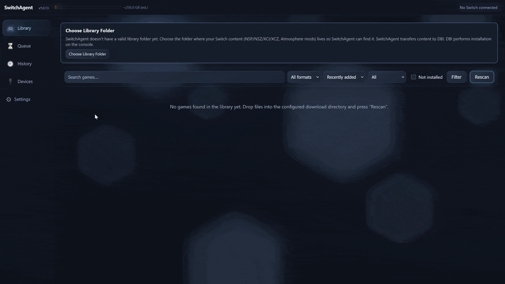

# SwitchAgent

**Install NSP/NSZ/XCI/XCZ packages, Atmosphère mods and homebrew ports onto
a Nintendo Switch from Windows, over USB** -- a library browser, a job queue and a
local web UI on top of [DBI](https://github.com/rashevskyv/dbi)'s "MTP
Responder" mode.

[](../../releases/latest)
[](../../releases)
[](../../releases/latest)
[](LICENSE)



📺 **[Watch the Web UI in action](https://www.youtube.com/watch?v=xm-BTAGAqhU)**
-- a short walkthrough of browsing the library and installing to a
console through DBI.

## What it does

A local, single-user Windows tool that turns a downloads folder full of
Nintendo Switch content (NSP/NSZ/XCI/XCZ install packages, Atmosphère
mod folders/archives and homebrew ports) into a browsable library, lets you pick what to
send to which physically-connected Switch (running the homebrew app
[DBI](https://github.com/rashevskyv/dbi) in "MTP Responder" mode), and
reliably delivers it over MTP with a persistent job queue that survives
restarts.

SwitchAgent does not install anything on the console itself -- DBI does
that. SwitchAgent's job ends at "the transport accepted the bytes." It
never overwrites an existing file automatically, never auto-retries a
failed job, and never substitutes a different target device than the one
a job was created for.

- **One library out of several folders** -- point it at the folders you
  download into and it scans, classifies and groups what it finds as
  **Base Game / Update / DLC / Mod**, including content still sitting
  inside a ZIP/7Z/RAR archive.
- **A homebrew port is one game** -- the forwarder `.nsp` and its
  `switch/` folder (as `switch.7z` or already unpacked) are one card.
  Installing it sends the forwarder to DBI and copies `switch/` onto the
  SD card as it is; the card warns you if the file its icon starts is not
  among the game's files.
- **A library that stays current** -- automatic folder scanning and live
  library updates, with game covers downloaded in the background and
  cached locally. Both automatic scanning and cover downloads can be
  turned off in Settings.
- **A queue that survives a restart** -- close the app, unplug the
  console or reboot Windows: an unfinished job is still there afterwards,
  marked `INTERRUPTED` and still bound to the device it was created for.
  It is never silently reported as installed and never silently re-sent.
- **Install order taken care of** -- Base Game -> Update -> DLC -> Mod.
- **One archive at a time** -- extract, send its contents, clean up the
  temporary payload, then move on to the next archive. Original library
  files stay untouched.
- **Live transfer progress** -- the Windows Portable Devices (WPD)
  transport reports bytes sent; the Windows Shell remains a fallback.
- **A read-only install journal** -- History shows transfers in order,
  their outcomes and local times. Actions belong in Queue; console
  contents belong in Devices.
- **Nothing happens by accident** -- an existing file on the console is
  never overwritten automatically, a failed job is never auto-retried,
  and a job never lands on a different console than the one you picked.
- **Usable away from the PC** -- LAN access is enabled by default, so the
  same web UI can open on a phone or tablet on your home network, subject
  to your Windows firewall settings. Use `--host 127.0.0.1` for PC-only access.
- **Nothing to install on the console** -- DBI does the installing;
  SwitchAgent's job is getting the bytes there over MTP, and saying
  honestly how that went.

## How it compares

If you already copy files to DBI's MTP mode through Windows Explorer,
this is the same transport with the parts Explorer knows nothing about:

| | Explorer over DBI MTP | SwitchAgent |
|---|---|---|
| Knows what a file actually is (Base/Update/DLC/Mod) | no | yes |
| Content inside ZIP/7Z/RAR | unpack by hand first | listed, and extracted for you |
| Homebrew port (forwarder + `switch/` folder) | copy `switch/` onto the card yourself | one card, both halves installed |
| Transfer interrupted halfway | nothing remembers it | job kept as `INTERRUPTED`, retried when you say so |
| Install order | your problem | Base -> Update -> DLC -> Mod |
| More than one console | whichever drive letter you clicked | each job is bound to one device |
| Record of what went where | none | install history |

[NS-USBloader](https://github.com/developersu/ns-usbloader) solves a
neighbouring problem by a different route: it speaks the Awoo / GoldLeaf
/ TinFoil USB protocols and runs anywhere Java does. If that is your
installer, use it -- SwitchAgent is for DBI's MTP mode specifically, on
Windows, with the library and the queue on top.

**Requirements:** Windows 10 or 11, 64-bit, with a Switch running DBI in
MTP Responder mode connected over USB. No Python or any other runtime
needs to be installed separately.

## Install (recommended)

1. Download `SwitchAgent-Setup-x64.exe` from the
   [latest release](../../releases/latest).
2. Run it. No admin rights needed -- it installs for your user only, to
   `%LOCALAPPDATA%\Programs\SwitchAgent`.
3. Launch **SwitchAgent** from the Start Menu (or the desktop shortcut,
   if you chose one during setup).
4. SwitchAgent starts its own local web server and opens it in your
   default browser automatically. A tray icon appears -- right-click it
   for **Open SwitchAgent** / **Exit**.
5. Running it again while it's already open just brings up the same web
   UI -- it never starts a second copy.

No Python, pip, or any dependency needs to be installed separately.

### First run

On first launch, SwitchAgent writes a config file to
`%LOCALAPPDATA%\SwitchAgent\config.yaml` and **scans nothing until you
choose a folder**. If your Windows **Downloads** folder can be detected
it is written into that file as a commented-out suggestion, ready to
uncomment -- but it is never adopted on your behalf: a real Downloads
folder is mostly unrelated files, and walking it unasked is not a
reasonable thing to do to somebody on first launch.

Open **Settings** in the web UI, which tells you plainly that no folder
is configured yet. Add your library folder there -- type or paste the
path, or use **Choose folder…** on the machine running SwitchAgent --
and it is checked before it is accepted; no config.yaml editing or
restart is needed (adding one re-scans automatically). Editing
`library: source_dir:` in config.yaml by hand still works too, if you
prefer.

You can add **several** folders and remove any of them with the **×**
next to it, including the last one: SwitchAgent then watches nothing and
clears its index. Removing a folder never touches the files themselves.

Your configured library folder, queue/install history, and settings are
never touched by an app update or reinstall.

## Portable version

Prefer not to install anything at all? Download
`SwitchAgent-Portable-x64.zip`, extract it anywhere (a USB stick works),
and run `SwitchAgent.exe` from inside that folder. All of its data
(database, logs, config) stays in that same folder -- nothing is written
to `%LOCALAPPDATA%` and nothing here conflicts with an installed copy.

## Uninstalling

Use *Add or remove programs* like any other app, or run the uninstaller
from the Start Menu group. Your database, config, and install history
under `%LOCALAPPDATA%\SwitchAgent` are **not** deleted by uninstalling --
remove that folder yourself if you want a truly clean slate.

## How a job finishes

A job can finish as **Installed** (`DONE`) or **Installed (unverified)**
(`DONE_UNVERIFIED`) -- the latter means SwitchAgent confirmed the file
transport completed, but the console's own install destination (`SD Card
install`) has no way to report back whether DBI actually finished
installing it. It is not a failure; it just isn't independently provable
over MTP -- check the console's own screen to confirm.

## Troubleshooting

- **Windows warns "Windows protected your PC" (SmartScreen)** -- this is
  expected for a small, independently-published app; click *More info* →
  *Run anyway*. See `docs/PACKAGING.md`'s "Code signing" section for why
  a signature doesn't always make this disappear immediately.
- **RAR files won't install** -- SwitchAgent can list/classify `.rar`
  archives out of the box, but actually unpacking one needs an external
  `unrar`, `7z`, or `bsdtar` tool on your `PATH` (e.g. install 7-Zip and
  add its folder to `PATH` -- its installer does not). Check the
  **Settings** page -- it tells you plainly whether RAR extraction is
  currently available. ZIP and 7Z work with no extra tool; a 7Z packed by
  a recent 7-Zip is unpacked with 7-Zip or with the `tar.exe` that comes
  with Windows.
- **Nothing happens when I double-click the EXE a second time** -- that's
  by design: SwitchAgent detected it's already running and just opened
  its existing web UI instead of starting a second copy.
- **Logs** live at `%LOCALAPPDATA%\SwitchAgent\logs\switchagent.log`
  (installed) or `.\logs\switchagent.log` next to the EXE (portable) --
  attach the relevant lines when filing an issue. They never contain a
  raw device serial number.

## Security model

SwitchAgent binds to `0.0.0.0` by default for home-network access. There is
no login: use it only on a trusted network. The app accepts loopback,
private LAN and Tailscale-range client addresses and rejects other source
addresses and browser requests marked cross-site. This address filter is
not user authentication. Use `--host 127.0.0.1` for access from this PC
only; do not expose the service through public port forwarding or a proxy.

There is no telemetry or automatic software installation. Outbound
requests serve two features:

- **Game covers:** enabled by default, downloaded in the background using
  the public TitleDB catalogue on GitHub and Nintendo image hosts. The
  catalogue is matched locally; image requests identify the requested
  cover. Disable cover downloads in Settings if you do not want these
  requests.
- **Version checks:** GitHub's public Releases API is checked at most once
  every 24 hours, or on demand with Settings' "Check now". The check sends
  no device IDs, library contents or install history. Updating the app is
  manual; you can choose to open the release page in your browser.

## Reporting an issue

Please open a [GitHub Issue](../../issues/new/choose) -- the bug template
asks for the four things that decide whether a report can be acted on:
your SwitchAgent version (Settings page, or `switch-agent --version`),
what happened, the relevant lines from `switchagent.log`, and what kind of
content was involved.

Found a security problem? Do not open a public issue -- see
[SECURITY.md](SECURITY.md).

## Building from source

```powershell
git clone https://github.com/Steklorez/SwitchAgent.git
cd SwitchAgent
python -m venv .venv
.venv\Scripts\activate
pip install -e .
pip install pytest
pytest -q
switch-agent web --mock   # try the Web UI without a real Switch
```

Building the packaged EXE/installer yourself is documented in
[`docs/PACKAGING.md`](docs/PACKAGING.md).

## Documentation

- [`CHANGELOG.md`](CHANGELOG.md) -- what changed in each release.
- [`docs/WEB-UI.md`](docs/WEB-UI.md) -- Web UI feature walkthrough.
- [`docs/PACKAGING.md`](docs/PACKAGING.md) -- how the Windows
  installer/portable build works and how to reproduce it.
- [`docs/PERF-MTP.md`](docs/PERF-MTP.md) -- why transfers are as fast as
  they are, and what was measured to get there.
- [`SECURITY.md`](SECURITY.md) -- what is and is not in scope, and how to
  report a vulnerability privately.

## License

[MIT](LICENSE). See [`THIRD_PARTY_NOTICES.md`](THIRD_PARTY_NOTICES.md)
for the licenses of bundled dependencies.

SwitchAgent includes no Nintendo firmware, keys, copyrighted assets, or
game content, and its icon is an original, unrelated-to-Nintendo graphic.

## Support the project

<div align="center">


### ☕ Enjoying SwitchAgent? Consider buying the author a cup of coffee!

[](https://ko-fi.com/I3I0273OYI)
[](https://boosty.to/steklorez)


</div>
