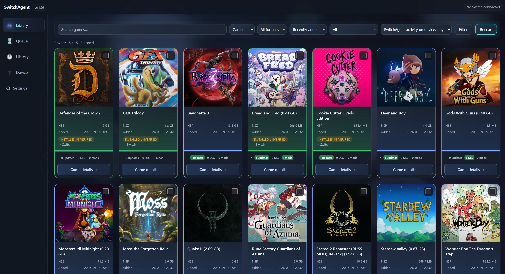

# SwitchAgent

<div align="center">


### ☕ Enjoying SwitchAgent? Consider buying the author a cup of coffee!

[](https://ko-fi.com/I3I0273OYI)
[](https://boosty.to/steklorez)


</div>

A local, single-user Windows tool that turns a downloads folder full of
Nintendo Switch content (NSP/NSZ/XCI/XCZ install packages and Atmosphère
mod folders/archives) into a browsable library, lets you pick what to
send to which physically-connected Switch (running the homebrew app
[DBI](https://github.com/rashevskyv/dbi) in "MTP Responder" mode), and
reliably delivers it over MTP with a persistent job queue that survives
restarts.

SwitchAgent does not install anything on the console itself -- DBI does
that. SwitchAgent's job ends at "the transport accepted the bytes." It
never overwrites an existing file automatically, never auto-retries a
failed job, and never substitutes a different target device than the one
a job was created for.

**Requirements:** Windows 10 or 11, 64-bit, with a Switch running DBI in
MTP Responder mode connected over USB. No Python or any other runtime
needs to be installed separately.



A job can finish as **Installed** (`DONE`) or **Installed (unverified)**
(`DONE_UNVERIFIED`) -- the latter means SwitchAgent confirmed the file
transport completed, but the console's own install destination (`SD Card
install`) has no way to report back whether DBI actually finished
installing it. It is not a failure; it just isn't independently provable
over MTP -- check the console's own screen to confirm.

## Install (recommended)

1. Download `SwitchAgent-Setup-x64.exe` from the
   [latest release](../../releases/latest).
2. Run it. No admin rights needed -- it installs for your user only, to
   `%LOCALAPPDATA%\Programs\SwitchAgent`.
3. Launch **SwitchAgent** from the Start Menu (or the desktop shortcut,
   if you chose one during setup).
4. SwitchAgent starts its own local web server and opens it in your
   default browser automatically. A tray icon appears -- right-click it
   for **Open SwitchAgent** / **Exit**.
5. Running it again while it's already open just brings up the same web
   UI -- it never starts a second copy.

No Python, pip, or any dependency needs to be installed separately.

### First run

On first launch, SwitchAgent writes a config file to
`%LOCALAPPDATA%\SwitchAgent\config.yaml` and tries to auto-detect your
Windows **Downloads** folder as the initial library source. If it can't
be detected, open **Settings** in the web UI, which tells you plainly if
no folder is configured yet. You can point SwitchAgent at your library
folder directly from that page -- type or paste the path, click
**Validate**, then **Save**; no config.yaml editing or restart is needed
(Save re-scans automatically). Editing `library: source_dir:` in
config.yaml by hand still works too, if you prefer.

Your configured library folder, queue/install history, and settings are
never touched by an app update or reinstall.

## Portable version

Prefer not to install anything at all? Download
`SwitchAgent-Portable-x64.zip`, extract it anywhere (a USB stick works),
and run `SwitchAgent.exe` from inside that folder. All of its data
(database, logs, config) stays in that same folder -- nothing is written
to `%LOCALAPPDATA%` and nothing here conflicts with an installed copy.

## Uninstalling

Use *Add or remove programs* like any other app, or run the uninstaller
from the Start Menu group. Your database, config, and install history
under `%LOCALAPPDATA%\SwitchAgent` are **not** deleted by uninstalling --
remove that folder yourself if you want a truly clean slate.

## Troubleshooting

- **Windows warns "Windows protected your PC" (SmartScreen)** -- this is
  expected for a small, independently-published app; click *More info* →
  *Run anyway*. See `docs/PACKAGING.md`'s "Code signing" section for why
  a signature doesn't always make this disappear immediately.
- **RAR files won't install** -- SwitchAgent can list/classify `.rar`
  archives out of the box, but actually unpacking one needs an external
  `unrar`, `7z`, or `bsdtar` tool on your `PATH` (e.g. install 7-Zip).
  Check the **Settings** page -- it tells you plainly whether RAR
  extraction is currently available. ZIP and 7Z always work with no
  extra tool.
- **Nothing happens when I double-click the EXE a second time** -- that's
  by design: SwitchAgent detected it's already running and just opened
  its existing web UI instead of starting a second copy.
- **Logs** live at `%LOCALAPPDATA%\SwitchAgent\logs\switchagent.log`
  (installed) or `.\logs\switchagent.log` next to the EXE (portable) --
  attach the relevant lines when filing an issue. They never contain a
  raw device serial number.

## Security model

SwitchAgent's web UI binds to `127.0.0.1` only by default -- it is not
reachable from other devices on your network or the internet unless you
explicitly start it with a different bind address yourself. It has no
telemetry, no auto-updater, and doesn't download or execute anything on
its own. The only outbound network request it ever makes on its own is a
periodic (at most once every 24h, or on demand via Settings' "Check now")
check against GitHub's public Releases API for a newer version number --
a bare request with no device IDs, library contents, or history in it,
and never anything more than opening the release page in your own
browser if you choose to.

## Reporting an issue

Please open a [GitHub Issue](../../issues) with what you did, what
happened, your SwitchAgent version (Settings page, or `switch-agent
--version`), and the relevant lines from `switchagent.log`.

## Building from source

```powershell
git clone <this repo>
cd switch-agent
python -m venv .venv
.venv\Scripts\activate
pip install -e .
pip install pytest
pytest -q
switch-agent web --mock   # try the Web UI without a real Switch
```

Building the packaged EXE/installer yourself is documented in
[`docs/PACKAGING.md`](docs/PACKAGING.md).

## Documentation

- [`docs/WEB-UI.md`](docs/WEB-UI.md) -- Web UI feature walkthrough.
- [`docs/PACKAGING.md`](docs/PACKAGING.md) -- how the Windows
  installer/portable build works and how to reproduce it.

## License

[MIT](LICENSE). See [`THIRD_PARTY_NOTICES.md`](THIRD_PARTY_NOTICES.md)
for the licenses of bundled dependencies.

SwitchAgent includes no Nintendo firmware, keys, copyrighted assets, or
game content, and its icon is an original, unrelated-to-Nintendo graphic.
